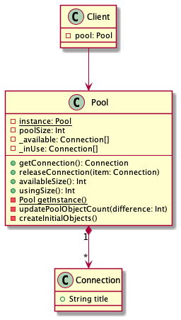

# Object Pool Design Pattern with Kotlin
Demonstration of Object Pool Design Pattern using Kotlin language and Coroutine.

### Abstract

> The object pool pattern is a design pattern that can improve performance when working 
> with classes that are slow to instantiate. Rather than constructing new objects, reusable 
> objects are retrieved from the pool as required. When no longer needed, objects are returned
> to the pool rather than being destroyed.
> - ***Singleton***: Singleton is a creational design pattern, which ensures that only one object of its kind exists and 
> provides a single point of access to it for any other code. Singleton has almost the same pros and cons as global variables.
> Although they're very useful for storing shared data where you need it, they break the modularity of your code and unit testing becomes harder
> - ***Pool***: The most important class. It works as a controller to handle clients' requests for reusable objects.
> - ***Object**s*: The reusable objects that are expensive or slow to instantiate.
> - ***Client***: The class that requests to use object(s) in the pool.
> 
> [Blackwasp](http://www.blackwasp.co.uk/ObjectPool.aspx)

### UML Diagram

### References

- [Blackwasp](http://www.blackwasp.co.uk/ObjectPool.aspx)
- [Alim Özdemir](https://alimozdemir.com/posts/design-pattern-serisi-2-object-pool/)
- [GitHub - ttny](https://github.com/ttnny/object-pool-example)
- [Plant UML](https://plantuml.com/)
- [Real World Plant UML](https://real-world-plantuml.com/)
